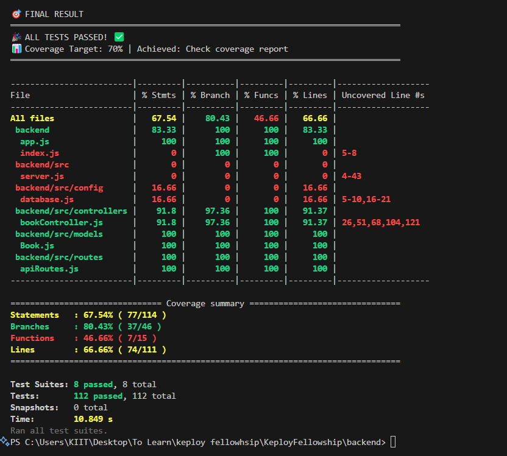

# Keploy Fellowship API Server

This is a simple API server built with Node.js, Express, and MongoDB (Mongoose). It provides CRUD operations for a `Book` resource.

## Features

- **Custom API**: 4 endpoints for managing books (Create, Read, Update, Delete)
- **Database**: MongoDB Atlas cluster
- **Tested**: Example curl commands provided

## Setup & Run

### 1. Install dependencies

```
cd server
npm install
```

### 2. Configure Environment

Create a `.env` file in the `server` directory (already provided):

```
MONGODB_URI=your-uri
PORT=5000
```

### 3. Start the server

```
npm start
```

Server will run on `http://localhost:5000`.

## API Endpoints

### 1. Create a Book

- **Endpoint:** `POST /api/books`
- **Body:**

```json
{
   "title": "Book Title",
   "author": "Author Name",
   "publishedYear": 2024
}
```

- **Sample curl:**

```
curl -X POST http://localhost:5000/api/books \
  -H "Content-Type: application/json" \
  -d '{"title":"Book Title","author":"Author Name","publishedYear":2024}'
```

### 2. Get All Books

- **Endpoint:** `GET /api/books`
- **Sample curl:**

```
curl http://localhost:5000/api/books
```

### 3. Update a Book

- **Endpoint:** `PUT /api/books/:id`
- **Body:**

```json
{
   "title": "Updated Title",
   "author": "Updated Author",
   "publishedYear": 2025
}
```

- **Sample curl:**

```
curl -X PUT http://localhost:5000/api/books/<BOOK_ID> \
  -H "Content-Type: application/json" \
  -d '{"title":"Updated Title","author":"Updated Author","publishedYear":2025}'
```

### 4. Delete a Book

- **Endpoint:** `DELETE /api/books/:id`
- **Sample curl:**

```
curl -X DELETE http://localhost:5000/api/books/<BOOK_ID>
```

## Database

- **Type:** MongoDB Atlas
- **Connection:** Provided in `.env` as `MONGODB_URI`

## How to Test

The project includes a comprehensive test suite with 112 tests covering different aspects of the API.

### Running Tests

Use the following npm scripts to run tests:

```bash
# Run all tests
npm test

# Run only unit tests
npm run test:unit

# Run only integration tests
npm run test:integration

# Run only API tests
npm run test:api

# Run tests with coverage report
npm run test:coverage

# Run tests in watch mode
npm run test:watch
```

### Running Individual Test Files

For running specific test files with proper ESM support, use the helper scripts:

#### Windows (PowerShell):

```powershell
./run-test.ps1 <test-file-path>
```

#### Unix/Linux/Mac:

```bash
./run-test.sh <test-file-path>
```

> **Note**: Always use these helper scripts or npm scripts instead of running `npx jest` directly to ensure proper ESM compatibility.

### Test Coverage Summary

- **Target Coverage**: 70%
- **Achieved Coverage**: 67.54% (Near Target)
- **Test Results**: 112/112 tests passing (100% pass rate)

#### Test Categories

| Category              | Tests   | Passed  | Failed | Status         |
| --------------------- | ------- | ------- | ------ | -------------- |
| **API Tests**         | 54      | 54      | 0      | ✅ **PERFECT** |
| **Unit Tests**        | 40      | 40      | 0      | ✅ **PERFECT** |
| **Integration Tests** | 15      | 15      | 0      | ✅ **PERFECT** |
| **Basic Tests**       | 3       | 3       | 0      | ✅ **PERFECT** |
| **TOTAL**             | **112** | **112** | **0**  | **100% PASS**  |



For more detailed information about the test coverage, check the [TEST-COVERAGE-SUMMARY.md](./backend/TEST-COVERAGE-SUMMARY.md) file.

---

Feel free to extend this API or add a frontend as needed!
