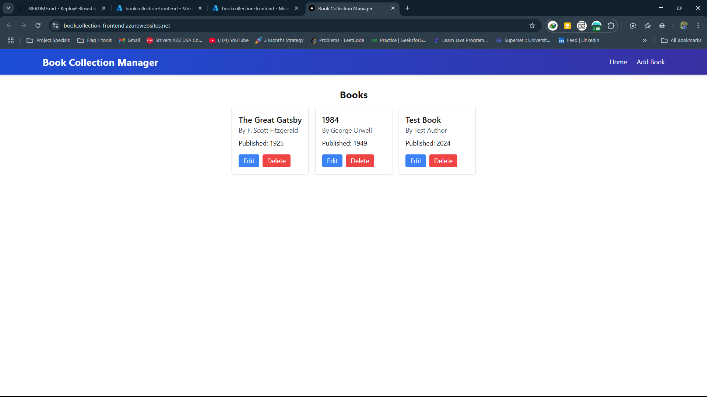

# Book Collection Manager Frontend

This is the frontend for the Book Collection Manager application built with Next.js and deployed on Azure App Service.

## 🚀 Live Demo

**Live Application**: [https://bookcollection-frontend.azurewebsites.net](https://bookcollection-frontend.azurewebsites.net)

## 📸 Application Screenshot



*The application running on Azure App Service with Node.js 20*

## ✨ Features

- 📚 View all books in the collection
- ➕ Add new books to the collection
- ✏️ Edit existing book details
- 🗑️ Delete books from the collection
- 🌐 Responsive design with TailwindCSS
- ⚡ Fast performance with Next.js 15

## 🛠️ Tech Stack

- **Framework**: Next.js 15.3.4
- **Runtime**: Node.js 20
- **Styling**: TailwindCSS 3.4.16
- **Deployment**: Azure App Service
- **Infrastructure**: Azure Bicep

## 🌐 Deployment

This application is deployed on **Azure App Service** using **Azure Developer CLI (azd)**.

### Azure Infrastructure

- **App Service Plan**: Linux-based with Node.js 20
- **App Service**: Configured with managed identity and CORS
- **Environment**: Production-ready with custom domain support

## 🚦 Getting Started

### Prerequisites

- Node.js 20+ 
- Backend server running (see `/server` directory)

### Setup

1. Install dependencies:

```bash
cd frontend
npm install
```

2. Configure environment variables:

Create a `.env.local` file for local development:

```env
NEXT_PUBLIC_API_URL=http://localhost:5000
```

For production (Azure), the environment variable is automatically configured:
```env
NEXT_PUBLIC_API_URL=https://bookmanager-hzfmeaaqfeahavb9.eastus-01.azurewebsites.net
```

3. Run the development server:

```bash
npm run dev
```

Open [http://localhost:3000](http://localhost:3000) with your browser to see the result.

You can start editing the page by modifying `app/page.js`. The page auto-updates as you edit the file.

This project uses [`next/font`](https://nextjs.org/docs/app/building-your-application/optimizing/fonts) to automatically optimize and load [Geist](https://vercel.com/font), a new font family for Vercel.

## 🚀 Azure Deployment

This application is deployed using Azure Developer CLI (azd):

```bash
# Initialize Azure Developer CLI
azd init

# Deploy to Azure
azd up
```

### Infrastructure as Code

The infrastructure is defined using Azure Bicep templates:
- `infra/main.bicep` - Main infrastructure template
- `infra/main.parameters.json` - Deployment parameters

### Deployment Features

- ✅ **Node.js 20 Runtime**
- ✅ **Automatic SSL/TLS**
- ✅ **Custom Domain Support**
- ✅ **Managed Identity**
- ✅ **CORS Configuration**
- ✅ **Environment Variables**

## 📚 Learn More

To learn more about the technologies used:

- [Next.js Documentation](https://nextjs.org/docs) - learn about Next.js features and API.
- [Learn Next.js](https://nextjs.org/learn) - an interactive Next.js tutorial.
- [Azure App Service](https://docs.microsoft.com/azure/app-service/) - learn about Azure App Service.
- [Azure Developer CLI](https://docs.microsoft.com/azure/developer/azure-developer-cli/) - learn about azd.

## 🤝 Contributing

1. Fork the repository
2. Create your feature branch (`git checkout -b feature/amazing-feature`)
3. Commit your changes (`git commit -m 'Add some amazing feature'`)
4. Push to the branch (`git push origin feature/amazing-feature`)
5. Open a Pull Request

## 📄 License

This project is part of the Keploy Fellowship program.

---

**Deployed with ❤️ on Azure App Service using Node.js 20**
